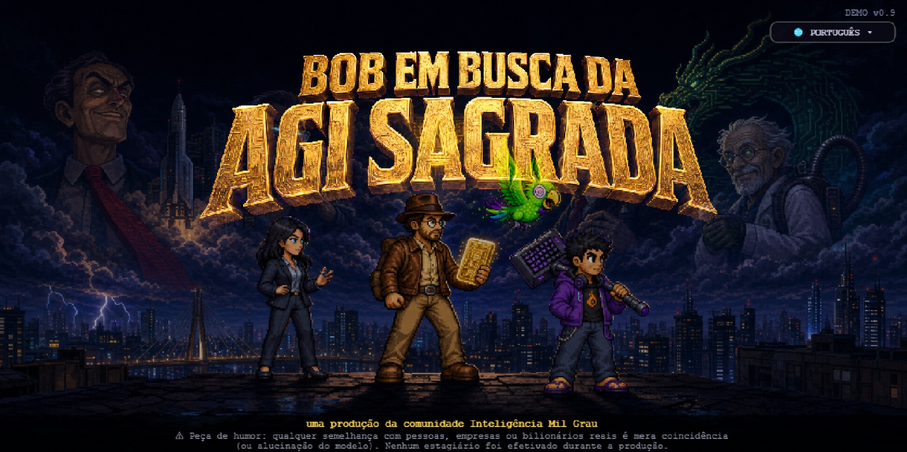
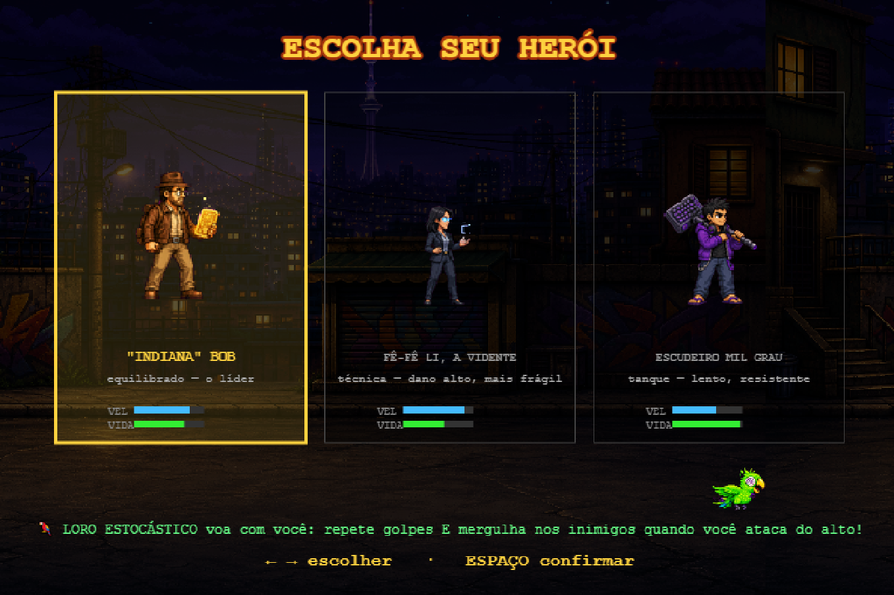
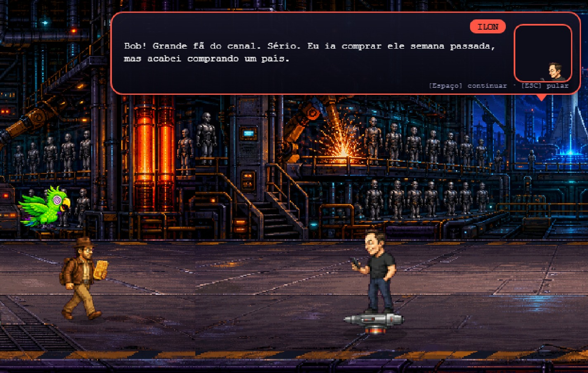
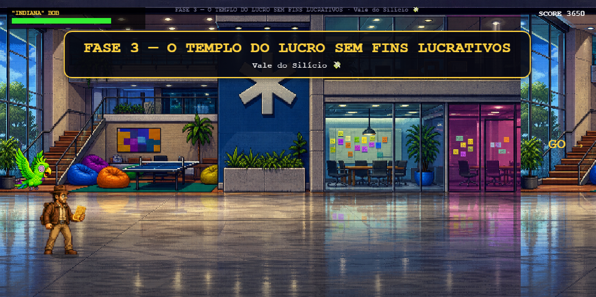

# 🏺 Bob em Busca da AGI Sagrada

Beat 'em up estilo *Streets of Rage* criado pela comunidade **Inteligência Mil Grau** —
uma paródia de Indiana Jones no mundo da IA. Bob e seus escudeiros percorrem o mundo
juntando as peças pra treinar a primeira AGI brasileira: o **CURUPIRA-1**. 🇧🇷

**▶ [Jogue direto no navegador](https://inteligenciamilgrau.github.io/agisagrada/)** — sem instalar nada. 🇧🇷 PT · 🇺🇸 EN · 🇪🇸 ES

## 📸 Telas do jogo

| Escolha seu herói — e o Loro vai junto |
|:--:|
|  |

| Cara a cara com o Ilon na Gigafábrica |
|:--:|
|  |

| Chegando no Vale do Silício |
|:--:|
|  |

## 🎮 Controles

| Tecla | Ação |
|-------|------|
| ← → ↑ ↓ / WASD | mover |
| J | atacar (funciona no ar: voadora!) |
| K | pular |
| L | especial (quando a barra encher) |
| Espaço | avançar diálogos |
| ESC | pular história |
| T | mapa do Plano da AGI |
| O | opções (idioma, dificuldade e áudio) |
| M | música on/off |
| F | tela cheia |

## 🗺 O jogo

- **7 fases**: São Paulo → Washington → Texas → Vale do Silício → Biblioteca Infinita → Muralha da China → Labs IMG
- **Mapa-múndi** com escolha livre de missão (a fase final tranca até completar as outras)
- **O Plano da AGI Sagrada**: 8 peças conquistadas ao longo da jornada — modelo, energia, grana, pesquisadores, dados, chips, galpão e o treino final
- **3 heróis jogáveis** + o Loro Estocástico, a LLM de bolso que repete seus golpes (com dano aleatório, claro)
- **5 chefões** baseados em zueira carinhosa com o mundo da IA
- Trilha sonora chiptune 100% sintetizada em WebAudio (zero arquivos de áudio!)

## 🛠 Como foi feito

- **Engine**: HTML5 Canvas + JavaScript puro, sem dependências
- **Roteiro**: Bob & [Claude Code](https://claude.com/claude-code)
- **Código**: [Claude Code](https://claude.com/claude-code) — com direção, testes e correções do Bob
- **Pixel art**: gerada com [agent-sprite-forge](https://github.com/0x0funky/agent-sprite-forge) no Codex
- **Direção criativa**: Bob e a comunidade Inteligência Mil Grau

Pra rodar localmente é só abrir o `index.html` no navegador.

## ⚠ Disclaimer

Este jogo é uma **peça de humor**. Qualquer semelhança com pessoas, empresas ou
bilionários da vida real é mera coincidência (ou alucinação do modelo).
Nenhum estagiário foi efetivado durante a produção.
